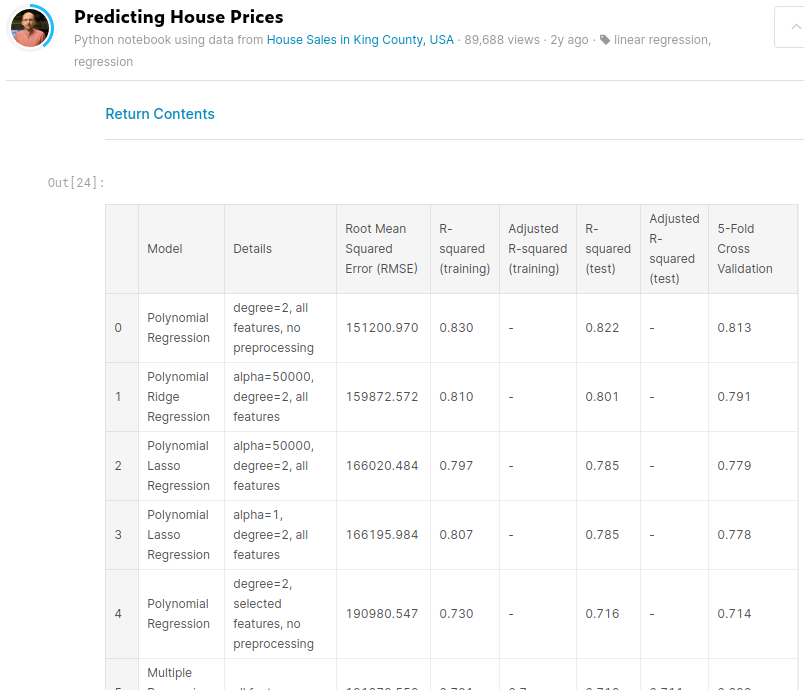

# King County
## Making my own scuffed Zillow

Here is my stab at statistical regression regarding house sale prices within
King County, WA. The independent variables concern such data as number of
bathrooms and whether the property has a nice view and I used them to predict
what price any given house in the data actually sold for, using a support
vector machine (or SVM) library. Of course there are very few perfect
algorithms and here there is no exception. So how good did I do? Well, here's
likely the best outcome on machine learning hub Kaggle, with over 700
up-boats:

His best model had a RMSE of 151200.970 US dollars. If you run my code you
should get a RMSE of 166832.8 US dollars. I may not be the absolute best in
the arena of machine learning but scoring only ~11% more than the true pros on
the test set—remember, it's like golf: the lower, the better—isn't too awful
for jack of all trades like me. 
